# 弹幕限制器

- **ID**: `heylyx841.danmaku_limiter`
- **作者**: Heylyx841
- **版本**: 1.1.2
- **最低 NipaPlay 版本**: 1.10.8

## 功能介绍

本插件监听 `danmakuLoaded` 事件，在弹幕正式渲染前进行高效拦截与实时优化：

- **密度限制**（独立开关，默认开启）：按1秒时间分桶，两阶段限流——先对同桶内相似弹幕模糊去重（调用原生相似度引擎，与合并阶段一致；若合并已开启则跳过去重），去重后仍超 `maxPerSec`（默认5条/秒）时均匀采样（等间距取），避免只保留最前面的弹幕。关闭后不执行限流和去重。
- **相似合并**（独立开关）：使用 NipaPlay 原生相似度引擎（C++ 实现，四级检测：完全相同 → 编辑距离 → 拼音距离 → 余弦相似度），在时间窗口内匹配相似弹幕，合并为单条并标注合并数，替代原生合并渲染。
- **跨类型合并**（独立开关，默认开启）：控制是否将不同类型（滚动/顶部/底部）的弹幕合并在一起，关闭后仅合并同类型弹幕。
- **小字兼容**：部分设备无法显示 Unicode 下标 ₍ɴ₎，开启后改用 (N) 标注合并数。
- **配置持久化**：提供设置页交互，支持独立开关及自定义每秒上限、合并窗口、相似度阈值，配置自动保存且跨会话持久化。

## 核心流程

```mermaid
flowchart TD
    Start([弹幕加载事件]) --> Refresh[刷新配置 refreshConfig]
    Refresh --> Check1{弹幕列表<br/>有效且非空?}
    Check1 -->|无效/空| End1([结束])
    Check1 -->|有效| Check2{合并或限流<br/>至少一项开启?}
    Check2 -->|否| End1
    Check2 -->|是| Prep{合并开启?}

    Prep -->|是| SortByTime[按时间排序]
    Prep -->|否| UseSrc[src = 原始列表]
    SortByTime --> NativeMerge
    UseSrc --> Phase2

    NativeMerge[原生相似度合并 nativeMerge]
    NativeMerge --> AvailCheck{引擎可用?<br/>similarityAvailable}
    AvailCheck -->|否| Fallback[回退: 返回原始列表]
    AvailCheck -->|是| BuildItems[构建 items 数组<br/>text / mode / time_seconds<br/>+ itemToOrig 索引映射]

    BuildItems --> CallEngine[调用 danmaku.checkSimilarity<br/>items + config<br/>max_dist / max_cosine /<br/>use_pinyin / cross_mode / time_window]
    CallEngine --> HasGroups{返回的 groups<br/>非空?}
    HasGroups -->|否| NoMergeResult[merged = src]
    HasGroups -->|是| ProcessGroups[遍历 groups<br/>标记 consumed / repOrigIdx<br/>代表弹幕添加 toGroupLabel 标注<br/>type / color 兜底]

    ProcessGroups --> AddRemaining[添加未合并且非代表的弹幕]
    AddRemaining --> SortMerged[按时间排序]
    SortMerged --> Phase2
    NoMergeResult --> Phase2
    Fallback --> Phase2

    Phase2{阶段二: 限流开启?}
    Phase2 -->|否| Output[working = merged]
    Phase2 -->|是| SplitTimed["分离 timed / untimed (untimed 不受限流)"]

    SplitTimed --> SortTimed["timed 按时间排序"]
    SortTimed --> Bucket["按 floor(time) 分桶 (1秒)"]
    Bucket --> ForEachBucket["遍历每个桶"]
    ForEachBucket --> MergeCheck{"合并已开启?"}
    MergeCheck -->|是| SkipDedup["跳过去重<br/>(合并阶段已完成)"]
    MergeCheck -->|否| NeedDedup{"桶内数量 > maxPerSec?"}
    NeedDedup -->|否| SkipDedup
    NeedDedup -->|是| EngineCheck{"引擎可用?<br/>similarityAvailable"}
    EngineCheck -->|否| SkipDedup2["跳过去重<br/>(返回原桶)"]
    EngineCheck -->|是| Dedup["阶段1: 模糊去重<br/>(原生相似度引擎<br/>达limit后提前终止)"]
    SkipDedup --> OverLimit
    SkipDedup2 --> OverLimit
    Dedup --> OverLimit{"去重后数量 <= maxPerSec?"}
    OverLimit -->|是| AcceptAll[全部接纳]
    OverLimit -->|否| UniformPop["阶段2: 均匀采样 (等间距取 maxPerSec 条)"]

    AcceptAll --> Collect
    UniformPop --> Collect
    Collect --> MergeBack[合并 untimed 弹幕]
    MergeBack --> ChangedCheck
    Output --> ChangedCheck

    ChangedCheck{弹幕结果<br/>数量发生变化?}
    ChangedCheck -->|是| Replace[danmaku.replace<br/>提示处理结果]
    ChangedCheck -->|否| NoChange[日志记录无实际限制]
    Replace --> End1
    NoChange --> End1
```

## 更新日志

### 1.1.2 更新

- **默认值修改**：`max_dist` 由 3 调整为 5、`mergeThreshold` 由 0.75 调整为 0.45、`crossMode` 默认由关闭改为开启；相似度阈值输入范围由 0.5~1.0 放宽为 0.0~1.0，允许更宽松的合并策略。
- **限流算法回退**：由滑动窗口回退为1秒分桶 + 两阶段限流（先模糊去重再均匀采样）；去重改用原生相似度引擎，与合并阶段一致；合并开启时跳过去重避免重复计算，修复只开启限流时滚动弹幕完全不加载的 bug。
- **修复开关重启丢失**：switch handler 改为从 Dart 持久化层读取新值，避免 JS 与 Dart 值脱同步导致翻转方向错误；移除 `saveSwitchConfig()` 消除双写覆盖。
- **引擎可用性检查**：合并前先调用 `danmaku.similarityAvailable()` 检查原生引擎状态，不可用时跳过合并而非静默失败。
- **原生相似度引擎**：合并弹幕改用 NipaPlay 内置的 `danmaku.checkSimilarity()` 原生 API（C++ 实现，四级检测：完全相同 → 编辑距离 → 拼音距离 → 余弦相似度），替代 JS 端 bigram 相似度计算，精度与性能大幅提升。
- **移除 JS 端相似度代码**：删除 `normalize()`、`similarity()`、`WIDTH_TABLE`（全角半角映射）、`PATTERN_ALIAS`（变体归一化规则）等约 70 行 JS 实现，由原生引擎统一处理。
- **移除 `modeToType()` 死代码**：该函数从未被调用。
- **合并逻辑优化**：`nativeMerge()` 使用 `itemToOrig` 数组做 O(1) 索引映射，替代 `indexOf` 的 O(n) 查找；使用 `repOrigIdx` 集合标记代表弹幕，替代遍历 groups 的 O(g) 检查。
- **限流分支合并**：删除 norm 去重后两个限流分支逻辑相同，合并为单一分支。
- **`minHostVersion` 提升至 `1.10.8`**（要求宿主提供 `danmaku.checkSimilarity()` API）。

### 1.1.1 更新

- **全角半角转换**：归一化处理新增全角→半角映射，使日文/中文输入法产生的全角字符（如 `ｈｅｌｌｏ` → `hello`）能正确参与相似度匹配。
- **变体归一化**：新增常见弹幕变体规则，如 `233`/`2333`/`23333` 归一为同一文本，`666`/`6666` 归一为同一文本，大幅提升合并率。
- **合并参数可配置**：合并窗口（默认30秒）和相似度阈值（默认0.75）现可在设置页自定义，不再硬编码。
- **相同文本快速路径**：归一化后完全相同的弹幕直接合并，跳过相似度计算，显著减少计算量。
- **频次最高代表选择**：合并多条弹幕时，选择出现频次最高的文本作为代表，避免偏门弹幕代表主流内容。
- **跨类型合并开关**：新增独立开关控制是否将不同类型（滚动/顶部/底部）的弹幕合并，默认关闭。
- **哈希表安全**：相似度计算和合并代表选择中的哈希表改用 `Object.create(null)`，避免原型链属性名冲突。
- **初始化可调试性**：`pluginOnInitialize` 中添加日志提示，方便排查配置恢复时序问题。
- **限流算法优化**：滑动窗口限流从前向指针扫描替代反向遍历，性能从 O(n·w) 提升至 O(n)。
- **拦截提示改为日志**：弹幕拦截/合并结果从 SnackBar 改为 `dev.log()` 记录，避免在链式管道中误报原始弹幕数量，同时减少视觉干扰。
- **移除总开关**：插件的启用/禁用由宿主设置页统一管理，不再需要插件内部的总开关。关闭密度限制和合并弹幕即可等效关闭所有功能。
- **开关持久化改用原生 API**：移除 `_cfg` 编码 hack，改用 `settings.setSwitch()` / `settings.getSwitch()` 原生开关持久化接口，不再将开关状态编码为字符串暴露给用户编辑。
- **移除 `_cfg` 内部条目**：设置页中不再显示内部配置码文本框，减少用户误操作风险。
- **拦截提示改为日志**：拦截/合并结果统一改为 `dev.log()` 记录，不再弹出 SnackBar，避免视觉干扰及链式管道中误报原始弹幕数量。
- **移除 `pluginOnInitialize` 中的 `refreshConfig` 调用**：因宿主初始化时序（运行时评估先于设置值加载），改为在 `danmakuLoaded` 事件中通过 `refreshConfig()` 恢复开关状态。
- **`minHostVersion` 提升至 `1.10.7`**。
- **流程图并入 README**。

### 1.1.0 更新

- **新增相似弹幕合并**：由于 NipaPlay 目前（插件开发时 NipaPlay 版本：1.10.6）的原生合并渲染在部分设备上存在显示异常，现已引入替代方案：通过此插件进行合并，并采用 ₍ɴ₎ 下标（或兼容模式下的 (N)）标注合并数量。
- **密度限制独立开关**：密度限制不再跟总开关捆绑。
- **新增小字兼容开关**：部分设备无法渲染 Unicode 下标字符 ₍ɴ₎，开启后改用 (N) 标注。
- **操作反馈更新**：拦截/合并生效时显示 SnackBar 提示；无实际过滤时提示「无实际弹幕限制」。
- **修改名称**：`弹幕数量控制器` → `弹幕限制器`。
- **`priority` 提升至 80**：确保在其他插件完成弹幕过滤后再执行限制。
- **修复开关状态重启丢失**：NipaPlay 目前仅对 `textSetting` 条目预加载持久化值，开关条目的值不在预加载范围，导致 App 重启后开关回滚为默认值。现通过 `_cfg` 配置码条目将所有开关状态编码持久化，暂时解决此问题。
- **修复合并弹幕字段缺失**：合并后的弹幕项对 `type` 和 `color` 字段增加了兜底默认值（`scroll` / `rgb(255,255,255)`），防止传入的数据缺少这些字段时引发渲染异常。
- **配置即时生效**：每次 `danmakuLoaded` 事件触发时先调用 `refreshConfig()`，确保用户在设置页的修改在下一次弹幕加载时立即生效。

### 1.0.4 更新

- **规范兼容**：升级 `pluginManifest`，适配 NipaPlay JS 插件新规范。
- **版本对齐**：最低宿主版本提升至 `1.10.6`，插件版本更新至 `1.0.4`。
- **优先级声明**：新增 `priority: 50`。

### 1.0.3 更新

- **ID 规范化**：迁移至唯一标识符 `heylyx841.danmaku_limiter`，符合插件市场规范。
- **高性能桶排序**：采用 JavaScript 稀疏数组替代对象哈希映射处理时间分桶，提升大规模弹幕处理性能。
- **低能耗 IPC 通信**：优化了与 Flutter 的桥接通信逻辑。仅在弹幕实际触发过滤、总数发生变化时才调用 `danmaku.replace`，若弹幕未超标则零开销跳过，降低 CPU 占用。
